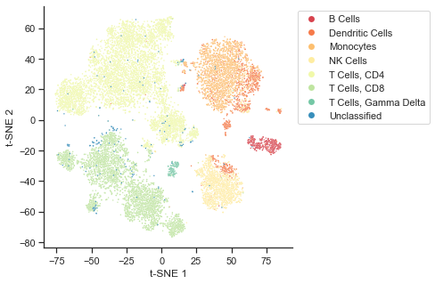
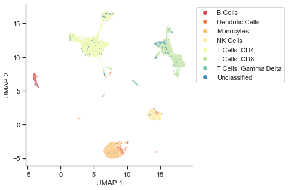

# pyBinaryClust
Python Re-implementation of the R package [BinaryClust](https://github.com/desmchoy/BinaryClust) - Tools for CyTOF analysis

The original R tool has now been published:

```
"Pre-treatment with systemic agents for advanced NSCLC elicits changes in the phenotype of autologous T cell therapy products"
Molecular Therapy - Oncolytics, 31, 100749 (2023)
https://doi.org/10.1016/j.omto.2023.100749

"ImmCellTyper facilitates systematic mass cytometry data analysis for deep immune profiling"
eLife, 13, RP95494 (2024)
https://doi.org/10.7554/eLife.95494.3
```


## Introduction
CyTOF data is log normal with zero inflation for most markers. For example:


pyBinaryClust takes advantage of this feature to subset cells for clustering by performing binary classifications on the markers. Using _K_-means clustering (_K_ = 2), it is possible to automatically separate cells into positive and negative populations. Here, _K_-means breaks down the cells into CD3+ (red) and CD3- (blue) populations:


This process is done in pyBinaryClust on all the markers separately to generate a classification matrix. A user-defined selection criteria will then classify these cells into different populations, which will then be individually clustered:


pyBinaryClust also comes with a set of functions to perform standard analysis tasks such as data exploration and data visualisation by _t_-SNE or UMAP.


## Prerequisites and Installation
To intall pyBinaryClust, you will first need to install one external dependency [FlowSOM_Python](https://github.com/saeyslab/FlowSOM_Python):

```
pip install git+https://github.com/saeyslab/FlowSOM_Python
```

Then pyBinaryClust can be installed via pip:

```
pip install pyBinaryClust
```

and imported as usual:

```
import pyBinaryClust as pyBC
import matplotlib.pyplot as plt   # For displaying and saving plots
```


## Required Input Files
To run standard BinaryClust analysis for a single CyTOF file, two files are needed:

1. A CyTOF FCS file (formats prior to FCS 3.1 not tested)
2. A cell classification file in CSV format

##### The FCS File
Please remove spaces and special characters from the file name as they will interfer with the code

##### The Cell Classification File
The cell stratification file should be in CSV format. An example is shown below. 
```
Cell Type,CD14,CD16,CD161,CD19,CD20,CD3,CD4,CD56_NCAM,CD8,TCRgd
NK Cells,-,A,A,-,A,-,A,+,A,A
Dendritic Cells,-,A,A,-,A,-,A,-,A,A
Monocytes,+,A,A,-,-,-,A,A,A,A
B Cells,-,-,-,+,A,-,A,A,A,A
"T Cells, Gamma Delta",-,A,A,-,A,+,A,A,A,+
"T Cells, CD4",-,A,A,-,A,+,+,A,-,-
"T Cells, CD8",-,A,A,-,A,+,-,A,+,-
```

`+` means positively expressed, `-` means negatively expressed and `A` means "any". Please use the `IO.print_parameters` function to choose marker names (see Feature Selection section below). As exemplified above, if there is a comma `,` in the cell type name, please ensure to encircle it with quotation marks.


## Feature Selection
Assuming you have an FCS file called `HD.fcs`, before loading the data, you can examine the marker distributions with the function `IO.examine_data`:

```
input_file = '/your/data/directory/HD.fcs'
pyBC.IO.examine_data(input_file)
```

which will return a graph:


This will allow identification of markers that are sufficiently well-behaved for binary classification.


The `IO.print_parameters` function will print the parameter page of the flowCore flowFrame object of the FCS file:

```
> pyBC.IO.print_parameters(input_file)
['Event_length', '89Y_CD45', '140Ce_Bead', '141Pr_CD196_CCR6', '142Nd_CD19', '143Nd_CD127_IL-7Ra', '144Nd_CD38', '145Nd_CD33', '146Nd_IgD', '147Sm_CD11c', '148Nd_CD16', '149Sm_CD194_CCR4', '150Nd_CD34', '151Eu_CD123_IL-3R', '152Sm_TCRgd', '153Eu_CD185_CXCR5', '154Sm_CD3', '155Gd_CD45RA', '156Gd_CD123', '158Gd_CD27', '159Tb_CD284', '160Gd_CD28', '161Dy_CD95', '162Dy_CD66b', '163Dy_CD183_CXCR3', '164Dy_CD161', '165Ho_CD45RO', '166Er_CD24', '167Er_CD197_CCR7', '168Er_CD8', '169Tm_CD25_IL-2Ra', '170Er_CD71', '171Yb_CD20', '173Yb_HLADR', '174Yb_CD4', '175Lu_CD14', '176Yb_CD56_NCAM', '191Ir_DNA1', '193Ir_DNA2', '195Pt_Live_Dead', '209Bi_CD11b']
```

When you load data, channels with underscore `_` will be chosen. Channels that contain 'Event_length', 'Bead', 'DNA', 'Live_Dead' and 'Viability' (case insensitive) are then removed. The remaining channels will have the heavy metal removed. Therefore, if the channel name is '89Y_CD45', the marker name will be 'CD45'. If the channel name is '141Pr_CD196_CCR6', the marker name will be 'CD196_CCR6'.


## Loading Data
The `IO.load_data` function will import your FCS file via `fcsparser` and return a data frame. By default, it will perform an arcsinh transformation with a cofactor of 5:

```
data = pyBC.IO.load_data(input_file)
```

There are various options under `IO.load_data` such as switching off data transformation, using a different cofactor or subsetting the data.

Non-redundancy scores (NRS) of all imported markers can be then be plotted out for examination:

```
pyBC.plot.plot_NRS(data)
```


## Binary Classification
Cell type stratification can then be achieved by simply running the `clustering.binary_class` function:

```
class_file = '/your/data/directory/cell_types.csv'
binary_results = pyBC.clustering.binary_class(data, class_file)
```

which exhaustively prints out the classification results:

```
>>> binary_results
          Cell Type
0      Unclassified
1      T Cells, CD4
2      T Cells, CD8
3         Monocytes
4      T Cells, CD8
            ...
15391  T Cells, CD4
15392  T Cells, CD4
15393  T Cells, CD8
15394  T Cells, CD4
15395      NK Cells

[15396 rows x 1 columns]
```

From experience, binary classification works better without scaling (standardising), but it is possible to scale the data with the `scale = True` argument. This results can then be summarised using the `clustering.binary_summary` function:

```
binary_summary = pyBC.clustering.binary_summary(data, binary_results)
```

```
>>> binary_summary
              Cell Type      CD45  CD196_CCR6  ...     CD11b  Frequency  Percentage
0               B Cells  5.028012    1.883772  ...  0.038630        495    3.215121
1       Dendritic Cells  4.570469    0.407006  ...  0.048264       1232    8.002078
2             Monocytes  5.075182    0.649553  ...  0.087890       1935   12.568200
3              NK Cells  4.721487    0.000000  ...  0.039241       1420    9.223175
4          T Cells, CD4  5.043390    0.148904  ...  0.029315       6092   39.568719
5          T Cells, CD8  5.050980    0.000000  ...  0.031300       3849   25.000000
6  T Cells, Gamma Delta  5.000837    0.081161  ...  0.040014        177    1.149649
7          Unclassified  5.015672    0.223516  ...  0.093452        196    1.273058

[8 rows x 39 columns]
```

This summary can then be plotted out using two functions. `pyBC.plot.plot_binary_abundances` will give you a barchart of the cell types:

```
pyBC.plot.plot_binary_abundances(binary_summary)
plt.show()
```


`pyBC.plot.plot_binary_median` will return a heatmap of median expressions of each marker for each cell type:

```
pyBC.plot.plot_binary_median(binary_summary)
plt.show()
```


## Data Visualisation with _t_-SNE and UMAP
BinaryClust can use the `scikit-learn` and `umap` modules to generate _t_-SNE and UMAP plots.

##### _t_-SNE
To run _t_-SNE, run the `DR.run_TSNE` function:

```
tsne_results = pyBC.DR.run_TSNE(data)
```

This will return raw _t_-SNE coordinates.

Random seed has been set to 1 to ensure reproducibility. Default is perplexity `per = 30`, which can be tuned to your needs. Please note that _t_-SNE requires a fair amount of computational resources so it might take a long time to run on a local installation.

There are two plotting functions associated with _t_-SNE. First, to colour the _t_-SNE plot by marker expressions, one can use the `plot.plot_DR_marker` function. For example:

```
pyBC.plot.plot_DR_marker(data, tsne_results, marker = 'CD8')
plt.show()
```


Binary classification results can be projected onto the _t_-SNE plot with `plot.plot_DR`:

```
pyBC.plot.plot_DR(binary_results, tsne_results)
plt.show()
```




##### UMAP
To run UMAP, run the `DR.run_UMAP` function:

```
umap_results = pyBC.DR.run_UMAP(data)

```

This will return raw UMAP coordinates.

Random seed has been set to 1 to ensure reproducibility. Please note that UMAP requires a fair amount of computational resources so it might take a long time to run on a local installation.

There are two plotting functions associated with UMAP. First, to colour the UMAP plot by marker expressions, one can use the `plot.plot_DR_marker` function. For example:

```
pyBC.plot.plot_DR_marker(data, umap_results, marker = 'CD8')
plt.show()
```


Binary classification results can be projected onto the UMAP plot with `plot.plot_DR`:

```
pyBC.plot.plot_DR(binary_results, umap_results)
plt.show()
```



There are additional options in the functions which would allow you to customise the plots. Please refer to the help pages for details.


## Clustering
Post-binary classification clustering can be achieved by the `clustering.cluster_subsets` function:

```
cluster_results = pyBC.clustering.cluster_subsets(data, binary_results)
```

The default is to run _K_-means clustering with _K_ = 40 (_i.e._ this time actually performing clustering rather than binary classification). It is possible to use FlowSOM instead by invoking `method = 'flowsom'` in the function:

```
cluster_results = pyBC.clustering.cluster_subsets(data, binary_results, method = 'flowsom')
```

This returns an exhaustive list of clustering results:

```
>>> cluster_results
          Cell Type Cluster
0      Unclassified      28
1      T Cells, CD4      37
2      T Cells, CD8      26
3         Monocytes      24
4      T Cells, CD8      36
            ...     ...
15391  T Cells, CD4      19
15392  T Cells, CD4      37
15393  T Cells, CD8      11
15394  T Cells, CD4      12
15395      NK Cells      16

[15396 rows x 2 columns]
```

Similar to the binary classification results, one can summarise this clustering results with `clustering.cluster_summary`:

```
cluster_summary = pyBC.clustering.cluster_summary(data, cluster_results)
```

```
>>> cluster_summary
        Cell Type  Cluster      CD45  ...  Frequency  Percentage  Cell Subtype
0         B Cells        0  5.071897  ...         10    0.064952              
1         B Cells        1  5.094877  ...         14    0.090933              
2         B Cells        2  5.118479  ...         17    0.110418              
3         B Cells        3  4.207917  ...         12    0.077942              
4         B Cells        4  4.785828  ...         12    0.077942              
..            ...      ...       ...  ...        ...         ...           ...
315  Unclassified       35  5.053456  ...          5    0.032476              
316  Unclassified       36  5.079406  ...          6    0.038971              
317  Unclassified       37  3.813907  ...          1    0.006495              
318  Unclassified       38  5.728721  ...          1    0.006495              
319  Unclassified       39  4.378670  ...          1    0.006495              

[320 rows x 41 columns]
```

The cluster summary is very important for further analysis, and can be exported as a CSV with `pandas` function:

```
cluster_summary.to_csv('/your/data/directory/HD_results.csv')
```

One can also plot out heatmaps for each cell type using the `plot.plot_cluster_heatmap` function. The third argument in the function has to be identical to an entry in the input CSV file:

```
pyBC.plot.plot_cluster_heatmap(data, cluster_results, 'T Cells, CD8')
```


## Differential Abundances and Expressions
Function coming soon.